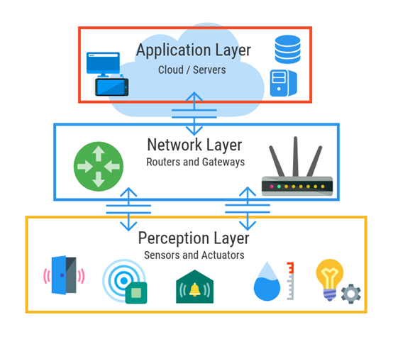
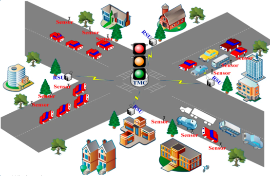
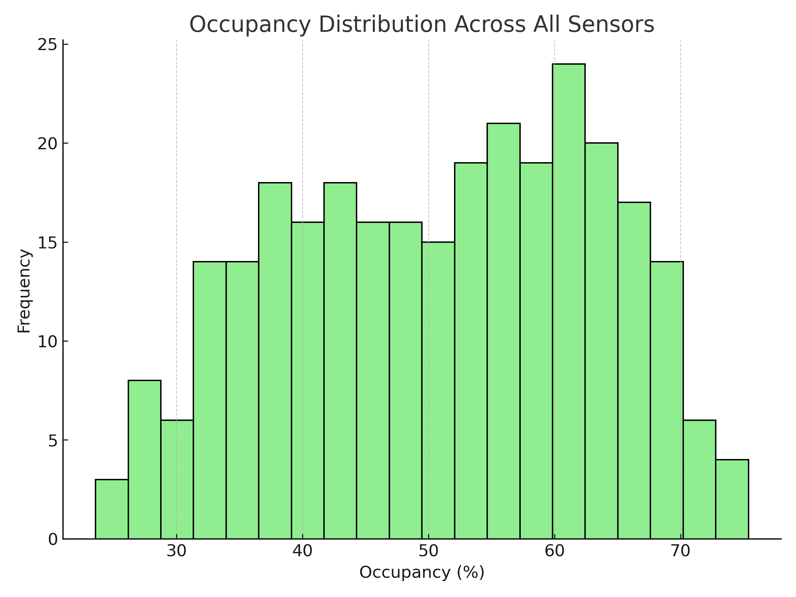
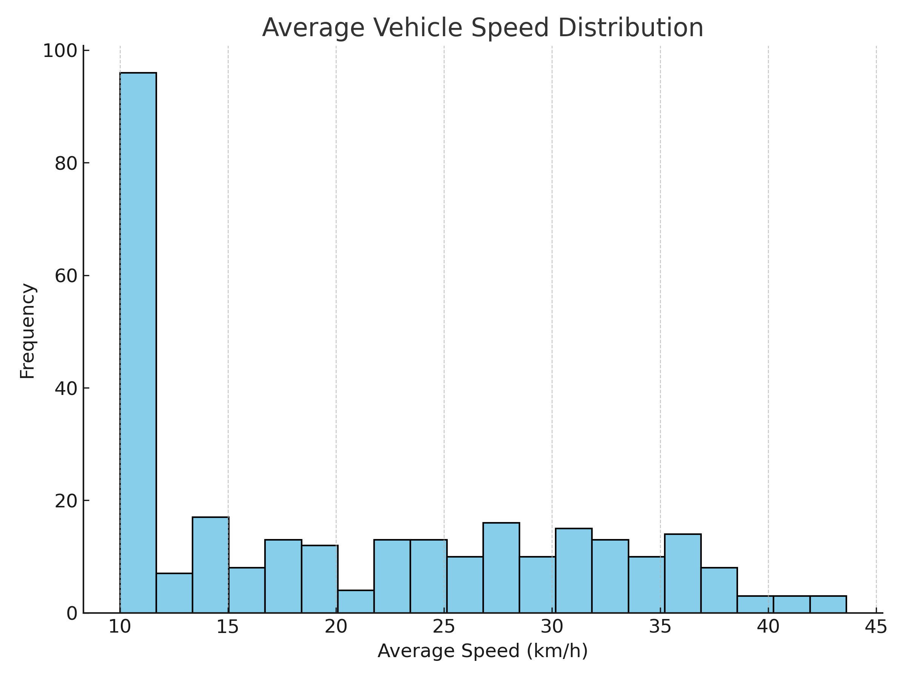

# IoT-Enabled Traffic Monitoring and Management System (2025) 🚦🛣️

An integrated framework leveraging **Wireless Sensor Networks (WSN)** for real-time traffic data acquisition, congestion analysis, and intelligent urban management. This project demonstrates how IoT data can optimize traffic flow and reduce environmental impact.

---

## 🚀 Project Overview
As urban populations grow, traditional traffic management fails to scale. This system proposes a modular architecture consisting of:
- **Perception Layer:** Ultrasonic and infrared sensors for vehicle counting and speed detection.
- **Network Layer:** Energy-efficient WSN for seamless data transmission.
- **Application Layer:** Real-time analysis for incident detection and adaptive signal control.

---

## 🛠 System Architecture & Framework
The system follows a rigorous design flow from conceptual modeling to simulation-based verification.

### 📐 System Design Flowchart
 
*(Note: Replace with the generated link after dragging image5.png here)*

### 🌐 Network Topology & Deployment

*(Note: Replace with the generated link after dragging image6.png here)*

---

## 📊 Results & Data Analytics
Using Python-based simulations, we generated and analyzed synthetic traffic data to evaluate system performance during peak and off-peak hours.

### Traffic Pattern Analysis
| Metric | Analysis Goal |
| :--- | :--- |
| **Volume Over Time** | Identifying peak congestion hours |
| **Speed Distribution** | Detecting bottlenecks and incidents |
| **Occupancy Rate** | Optimizing lane usage and signal timing |

#### 📉 Statistical Visualization
- **Traffic Volume & Average Speed:**

- **Daily Distributions:**

---

## 📁 Repository Structure
- `📂 Report & Presentation/`: Contains the full technical documentation and project slides.
- `📂 Simulation & Results Analysis/`: Python scripts for data generation and performance modeling.
- `📂 Media/`: High-resolution system diagrams, flowcharts, and statistical plots.

---

## 📚 References & Literature Review
This project includes a comprehensive review of Q1 journal articles, identifying gaps in vehicular sensing and fog computing for smart traffic control.
1. **Al-Dhubaibi, T. A. (2025).** *IoT-Enabled Traffic Monitoring and Management System*. Department of Telecommunications & Networks Engineering, Sana'a University.
2. Modeling and analysis techniques based on network observability (2025).

---

## 👨‍🔬 About the Author
**Theyazan A. Al-Dhubaibi** *Telecommunications & Network Engineer | AI Researcher* Founder of **Syncolars for Academic Studies & Research**. Focused on 5G/6G, IoT security, and intelligent infrastructure.

---
*"Innovating urban mobility through intelligent connectivity."*
